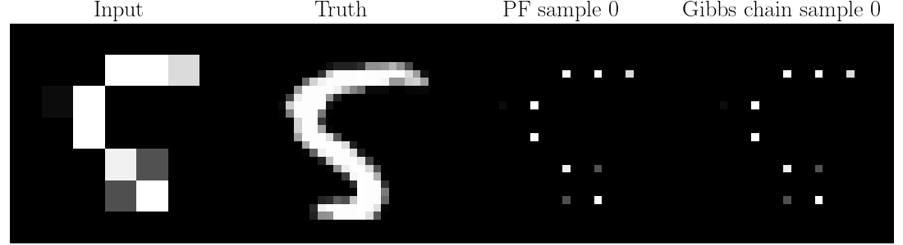
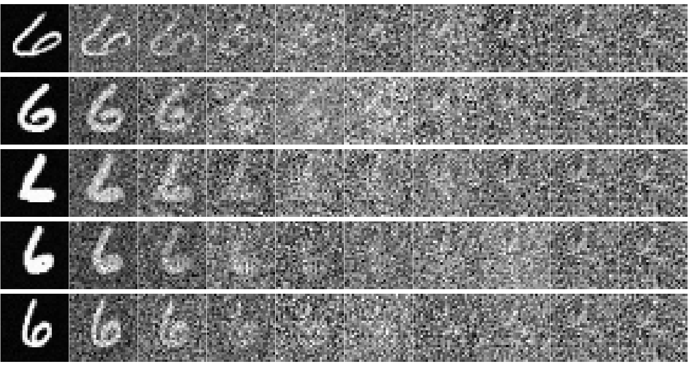

# A computational introduction to stochastic differential equations

This course aims to develop a computational view of stochastic differential equations (SDEs) for students who have an applied or engineering background, e.g., machine learning, signal processing, statistics, computer vision, and control.

**The course for the year 2022 is now archived. Please find the archive in https://github.com/spdes/computational-sde-intro-lecture/releases or in the branch `2022-uu`.
A feedback report of the course can be found in the folder `./annual_reports/2022`.**

In this year 2025, we have decided to make some changes to the course compared to that of 2022:

- Due to practical issues, we have to run the course in a smaller scale this time. Some lectures have been cut (e.g., smoothing, GPs, and seminar). You can look up the 2022 archive for the full comprehensive programme.
- We have added lectures for generative diffusion models.
- The course will take place at Linköping University.

# Prerequisites

1. Linear algebra.
2. Real analysis (not essential, but very useful).
3. Probability theory.
4. Ordinary differential equations.

# How to register

Please register by using this link https://forms.gle/1aHXhUrJTaUcBVnC8. 

# Lecture notes

The lectures are primarily given on chalkboard (numerical experiments are given in Jupyter Notebook). 
It is recommended that students take notes during the class, although the lecture notes (possibly hand-written) will be uploaded to this repository.

# Lectures (ECTS 6 credits)
Most lectures are given on site and are not possible for remote attendance. 
You may attend Lectures 4 - 5 over Zoom but we may not have a camera to show blackboard presentations.

0. [**Introduction to the course**](./lectures/lecture_notes/lecture0.pdf).  
    Please go through this lecture note by yourself prior to attending the course.  
    Explain the contents, schedule, and examination of the course.

1. [**Stochastic differential/integral equations**](./lectures/lecture_notes/lecture1.pdf).  
    03 Nov 2025. Room John Von Neumann (remote attendance not possible). 08.15 - 10.00.
    The construction and definition of SDEs.

2. [**Numerical solution to stochastic differential equation**](./lectures/lecture_notes/lecture2.pdf).  
    03 Nov 2025. Room John Von Neumann (remote attendance not possible). 13:15 - 15:00.
    The numerical simulation of SDEs.

3. [**Distribution and statistics of SDE solutions**](./lectures/lecture_notes/lecture4.pdf).  
    04 Nov 2025. Room John Von Neumann (remote attendance not possible). 08.15 - 10.00.
    This will cover, Langevin dynamics, Kolmogorov forward equation, and how to numerically compute expectations of SDEs. 

4. [**Linear SDEs and stochastic filtering**](./lectures/lecture_notes/lecture4.pdf).  
    04 Nov 2025. Room John Von Neumann (remote attendance not possible). 13:15 - 15:00.
    Linear SDEs are an important class of SDEs, especially for generative diffusion models. 
    This lecture explains the basic properties of linear SDEs, as well as slighly explain the stochastic filtering problem.

5. [**Generative diffusion models**](./lectures/lecture_notes/lecture5.txt).  
    05 Nov 2025. Room John Von Neumann (Zoom possible at xxx but not recommended). 08.15 - 10.00.
    Training and sampling of generative diffusion models (to be updated). 

6. [**Generative diffusion posterior sampling**](./lectures/lecture_notes/lecture6.txt).  
    05 Nov 2025. Room John Von Neumann (Zoom possible at xxx but not recommended). 13:15 - 16:00.
    Posterior/conditional sampling of generative diffusion models. Say, e.g., how to generate images satisfying given conditions (to be updated).

7. [**Guest lectures (TBD)**](./lectures/lecture_notes/xxx.pdf).  
    06 Nov 2025. Room John Von Neumann (Zoom possible at xxx). 08.15 - 12.00
    Research talks on generative diffusion models, mostly given by our local PhD students. 
    This programme is tentative and may be cancalled if we don't receive enough on-site students. 
    Tentative programme (to be updated):
    - Generative Schrödinger bridges (Zheng Zhao). 
    - Bayesian inverse problems with decoupled diffusion sequential Monte Carlo (Filip Kelvinius).
    - More ...

# Exercises

We have four exercise assignments, and we will explain their solutions at two exercise sessions. 
You are supposed to pass all the four assignments and hand-in your solutions to the lecturer prior to attending the exercise session. 
For example, the session for explaning Exercises 1 & 2 takes place at 13.15 on 20 Nov. You should email your solutions of Exercises 1 and 2 to the course responsible, before this time.

**Note: the exercises have not been updated for 2025.**
-  [**Exercise 1**](./exercises/exercise1.pdf).  
    Session at 20 Nov 2025. Room John Von Neumann (Zoom possible at xxx). 13:15 - 15:00.  
-  [**Exercise 2**](./exercises/exercise2.pdf).  
    Session at 20 Nov, 2025. Room John Von Neumann (Zoom possible at xxx). 13:15 - 15:00.  
-  [**Exercise 3**](./exercises/exercise3.pdf).  
    Session at 04 Dec, 2025. Room John Von Neumann (Zoom possible at xxx). 13:15 - 15:00.  
-  [**Exercise 4**](./exercises/exercise4.pdf).  
    Session at 04 Dec, 2025. Room John Von Neumann (Zoom possible at xxx). 13:15 - 15:00.  

# Course arrangement

The course consists of lectures, exercises(, and project work). Total credit is 6 or 9, graded based on pass/fail.

In order to get 6 credits, you need to 

- actively participate all the lectures,
- and pass all the four exercise assignments (see Exercises above). 

If you would like to upgrade to 9 credits, you need to fulfill the requirements for the 6 credits as stated above, and in addition, 

- do a project work and write a report (see the next section). 

# Project work

Our intent of the project work is for you to apply what you have learnt about SDEs to solve your own research problems, and possibly aiming for a publication.
For example, in 2022 we have students applied SDEs for image restoration and tumor modelling. 
You can find some example project reports in `./projects` by our students in 2022.

You should discuss with the lecturer *well in advance* to select a topic. 
The deadline to hand-in the project work is 19.12.2025.

You do not need to do a project work if you are not aiming for 9 credits. 

# Reading materials

This course is mainly based on the following textbooks.

- Hui-Hsiung Kuo. Introduction to stochastic integration. Universitext. Springer, 2006.
- Simo Särkkä and Arno Solin. Applied stochastic differential equations. Cambridge University Press, 2019.
- Ioannis Karatzas and Steve E. Shreve. Brownian motion and stochastic calculus. Springer, 2nd edition, 1991.

# Course history

- Nov 2025, Linköping University.
- Oct - Dec 2022, Uppsala University, FTN0332 TN22H006.

# Contact

Zheng Zhao, Linköping University. 

firstname.lastname@liu.se

https://zz.zabemon.com.
