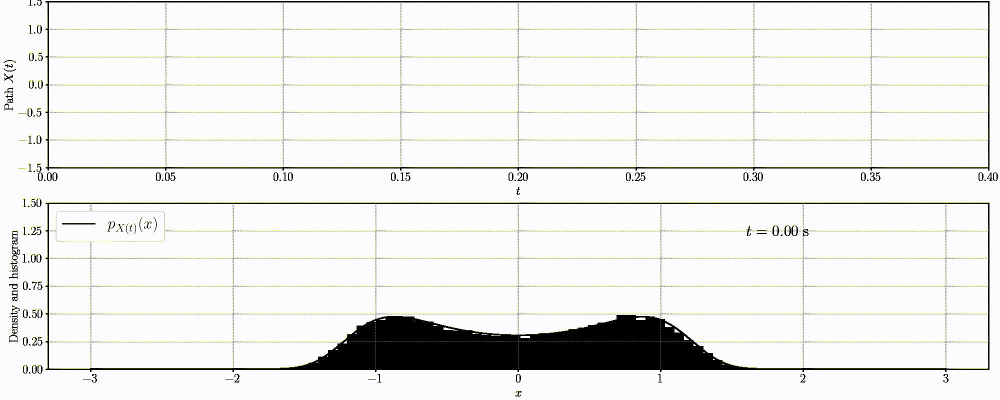

# A computational introduction to stochastic differential equations

This course aims to develop a computational view of stochastic differential equations (SDEs) for students that have an applied or engineering background, e.g., machine learning, signal processing, electrical engineering, control, and statistics.

# Prerequisites

1. Linear algebra
2. Real analysis (not essential)
3. Probability theory
4. Ordinary differential equations

# How to register

The registration is now closed. If you still would like to enroll the course, please send an email to the course responsible.

# Lecture notes

The lectures are given on chalkboard (numerical experiments are given in Jupyter Notebook). Hence, it is recommended that students take notes during the class, although the course responsible will upload the lecture notes (possibly hand-written) to this repository.

# Essential lectures (6 credits)

1. [**Introduction to the course**](./lectures/lecture_notes/lecture1.pdf).  
    17 Oct, 2022. Room 4005 Ångström. 13:15 - 15:00.

2. [**Stochastic differential/integral equations**](./lectures/lecture_notes/lecture2.pdf).  
    21 Oct, 2022. Room 101132 Ångström. 13:15 - 15:00.

3. [**Numerical solution to stochastic differential equation**](./lectures/lecture_notes/lecture3.pdf).  
    24 Oct, 2022. Room 101127 Ångström. 13:15 - 15:00.

4. [**Statistical properties of SDE solutions**](./lectures/lecture_notes/lecture4.pdf).  
    28 Oct, 2022. Room 101142 Ångström. 13:15 - 15:00.

5. [**Linear SDEs and Gaussian processes**](./lectures/lecture_notes/lecture5.pdf).  
    31 Oct, 2022. Room 101146 Ångström. 13:15 - 15:00.

-  [**Exercise 1**](./exercises/exercise1.pdf).  
    2 Nov, 2022. Room 101127 Ångström. 13:15 - 15:00.  
    In this exercise session, the students should deliver answers to the assignments that are associated with Lectures 2 - 3.

6. [**Filtering and smoothing problems I (i.e., regression with SDE prior)**](./lectures/lecture_notes/lectures_6_and_7.pdf).  
    4 Nov, 2022. Room 101127 Ångström. 13:15 - 15:00.

7. [**Filtering and smoothing problems II (i.e., regression with SDE prior)**](./lectures/lecture_notes/lectures_6_and_7.pdf).  
    7 Nov, 2022. Room 101150 Ångström. 13:15 - 15:00.

-  [**Exercise 2**](./exercises/exercise2.pdf).  
    9 Nov, 2022. Room 101150 Ångström. 13:15 - 15:00.  
    In this exercise session, the students should deliver answers to the assignments that are associated with Lectures 4 - 5.

8. [**Parameter estimation for stochastic continuous-time dynamical models**](./lectures/lecture_notes/lecture8.pdf).  
    11 Nov, 2022. Room 101142 Ångström. 13:15 - 15:00.  
    This lecture presents estimation methods for SDEs. These are typically based on discrete-time measurements, and therefore the transformation of the original model into a discrete-time model is important. The focus is on the linear time-invariant case. We will briefly discuss sampling of continuous-time models, the main challenges of estimating continuous-time models, and describe some of the available basic estimation approaches. The approaches can be divided into direct approaches and indirect approaches. Among the direct approaches is the maximum likelihood method, which is based on exact discretisation of the model and a discrete-time Kalman filter. 
    Lecturer: [Mohamed Abdalmoaty](https://user.it.uu.se/~mohab408/)

-  [**Exercise 3**](./exercises/exercise3.pdf).  
    18 Nov, 2022. Room 101127 Ångström. 13:15 - 15:00.  
    In this exercise session, the students should deliver answers to the assignments that are associated with Lectures 6 - 8.

-  **Student project work presentation**.  
    16 Dec, 2022. Room 101142 Ångström.

The time is 13:15 - 15:00 for all the lectures (45 mins + 10 mins break + 45 mins).

# Seminar lectures (9 credits)

By attending (not necessarily all) the seminar courses and completing their writing assigments/exericses, you get upgrade to 9 credits.

1. **Differential geometry for continuous-time stochastic filtering: the projection filter**.  
    The continuous-time stochastic filtering problem consists in solving the Kushner--Stratonovich equation which is an infinite-dimensional stochastic partial differential equation difficult to solve. In this lecture, we introduce a differential geometry approach for solving the equation: the projection filtering. The projection filters approximate the filtering solution by projecting the solution onto a manifold of parametric familiy, resulting in a finite-dimensional stochastic differential equation that is easy to solve. Then, we discuss the recent advances and challenges of the projection filtering.  
    Date: 13:15 - 14:45, 17 Nov, 2022. Zoom https://uu-se.zoom.us/j/66304380076  
    Lecturer: [Muhammad Fuady Emzir](https://scholar.google.com/citations?user=nfBRAHAAAAAJ&hl=en) (KFUPM)

2. **SDEs and Markov chain Monte Carlo**.  
    In this lecture, we present a general recipe for constructing Markov chain Monte Carlo (MCMC) samplers, including stochastic gradient (SG) versions, from stochastic continuous dynamics (SDEs). We also explore the connections between SG-MCMC and stochastic optimization methods via simple annealing techniques. Recommended readings: 1) Bayesian Learning via Stochastic Gradient Langevin Dynamics 2) A Complete Recipe for Stochastic Gradient MCMC.  
    Date: 09:15 - 11:00, 22 Nov, 2022. Room 4101 Ångström  
    Lecturer: [Cagatay Yildiz](https://cagatayyildiz.github.io/) (University of Tübingen)

3. **Probabilistic numerics for ordinary differential equations**.  
    Probabilistic numerical methods aim to explicitly represent the numerical uncertainty that results from limited computational resources. In this lecture, we present a class of probabilistic numerical solvers for ODEs which pose the numerical solution of an ODE as a Gauss--Markov regression problem. The resulting methods, called "ODE filters", efficiently compute posterior distributions over ODE solutions with methods from Bayesian filtering and smoothing.  
    Date: 13:15 - 15:00, 22 Nov, 2022. Room 2001 Ångström  
    Lecturer: [Nathanael Bosch](https://nathanaelbosch.github.io/) (University of Tübingen)

4. **Compiled and differentiable programming with JAX**.  
    [JAX](https://github.com/google/jax) is a Python library that supports autodifferentiation and just-in-time (JIT) compilation. You can use JAX to differentiate Python and Numpy functions and make them faster with the JIT compilation. This helps you to achieve reliable and high-performance computations in your research. In this lecture, we go walk through the basics of JAX then see how we could apply it to the applications of SDEs.  
    Date: 28 Nov, 2022. Room 101127 Ångström

5. **Topic TBD**.  
    2 Dec, 2022. Room 101127 Ångström.  
    Lecturer: [Roland Hostettler](http://hostettler.co/) (Uppsala University)

6. **Constructions of Wiener processes and stochastic integrals**.  
    This lecture explains the constructions of Brownian motion and Ito integrals.  
    Date: 5 Dec, 2022. Room 101127 Ångström

# Reserved timeslots

We have also reserved 09.12.2022 and 12.12.2022 at Room 101127 Ångström, 13:15 - 15:00 as backup.

# Course arrangement

The course consists of lectures, exercises, and project work. Specifically, in each week, there would be one/two lectures (45 + 45 mins) and an exercise session (60 mins). The students shall present and discuss their exercise solutions during the exercise session. 

Total credit is 6 or 9.

In order to get 6 credits, you need to 

- actively participate all the essential lectures,
- pass the three exercise assignments,
- present the project work. Depending on the number of students, you may do the project work in group.

If you would like to get 9 credits, you need to fulfill the requirements for the 6 credits as stated above, and in addition, 

- actively participate all the seminar lectures,
- Select five from all the seminar lectures, then pass the exercises of the selected, or do a writing assignment if the lecture has no exercise. (We will define the writing assignment later).

The course grade is based on pass/fail.

# Project work

To be added.

# Reading materials

This course is mainly based on the following textbooks.

- Hui-Hsiung Kuo. Introduction to stochastic integration. Universitext. Springer, 2006.
- Simo Särkkä and Arno Solin. Applied stochastic differential equations. Cambridge University Press, 2019.
- Ioannis Karatzas and Steve E. Shreve. Brownian motion and stochastic calculus. Springer, 2nd edition, 1991.

# Course history

- Oct - Dec, 2022, Uppsala University, FTN0332 TN22H006.

# Contact

Zheng Zhao, Uppsala University. 

firstname.lastname@it.uu.se

https://zz.zabemon.com
